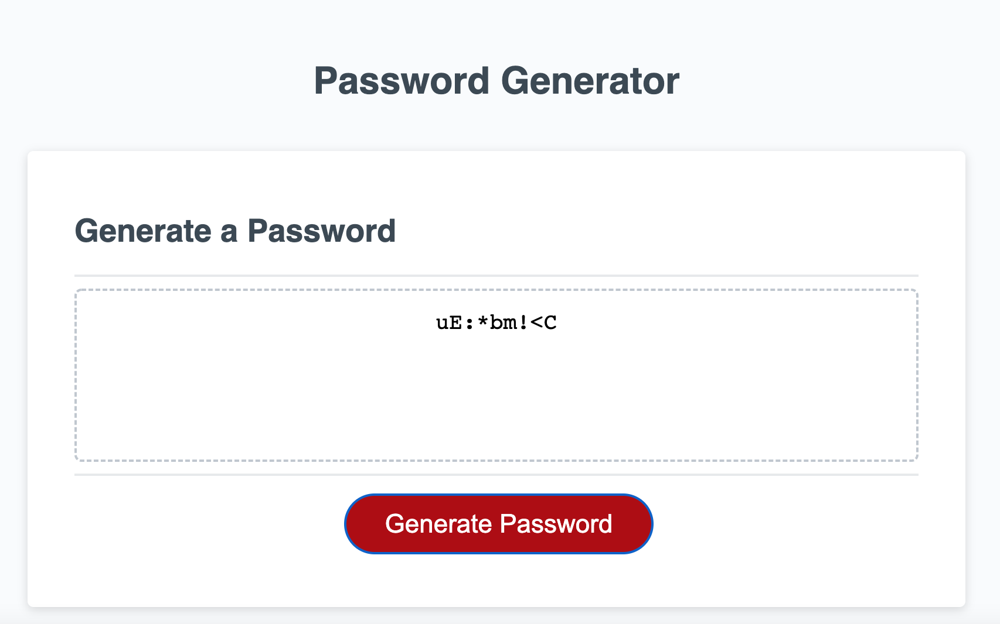

# challenge-03

# Random Password Generator

Use the site to create a custom random password based on user input.

## Description

Clicking "Generate Password" will queue up a series of prompts which, when answered will include various character types into 
a resulting randomnly generated password. The password creation is based around the creation of an array of characters scrambled using the Math.random property

## Getting Started

### Dependencies

* Internet Browser with basic functionality is all that is required.
* ex. Windows 10

### Executing program

1. Click Generate Password
2. Answer prompts provided
3. Observe the generated password printed to the textbox, and copy the password for your convenience. 

## Help

In the event a desired character is not printed to the textbox, refreshing the page and trying again will 
usually provide the desired selections. The author has made an effort to provide equal number of characters across 
the selection categories thus minimizing the possibility of a lack of desired included characters type.

## Authors

Jake Lauterstein

jakelauterstein@gmail.com

## Link to deployed Application

## Screenshot 

## Version History
* 0.3 
    * Added randomized generation functionality
* 0.2
    * Created basic functionaslity
* 0.1
    * Initialized files

## Acknowledgments

Assistance provided by :

* UT Coding Bootcamp ASKBCS
* UT Coding Bootcamp Tutoring

